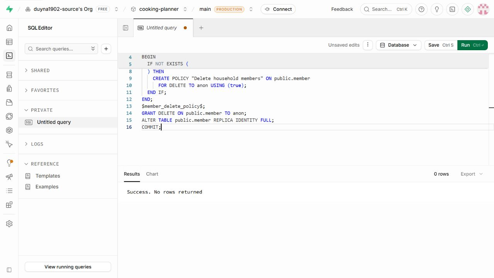
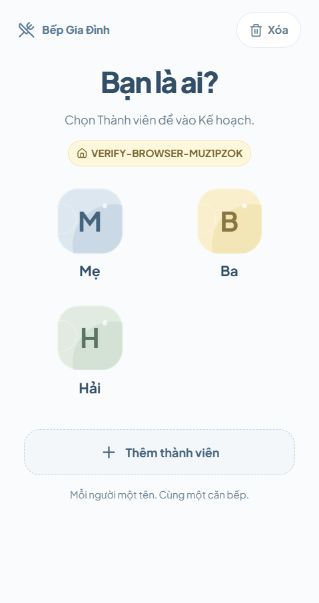
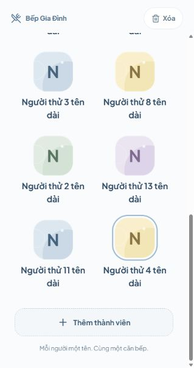
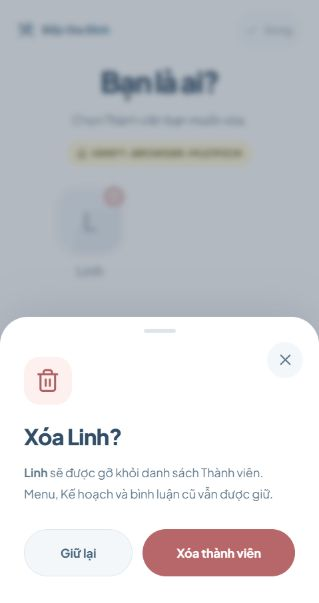

# Kiểm tra database và browser — Thành viên

Ngày: 2026-10-08

Nguồn phạm vi: [spec](./spec.md), [ticket 01](./issues/01-member-selection-screen.md).

## Database thật

Project `cooking-planner`, ref `ookbaokwcahtevihobnj`; dùng anon client như ứng dụng. Trước khi kiểm tra, bảng `public.member` có 0 bản ghi và RLS đang bật.

- Đã áp dụng `supabase/migrations/20261008_member_delete.sql`: policy/quyền DELETE cho `anon`, replica identity FULL. SQL Editor xác nhận `Success. No rows returned`.
- Thêm tên `  Mẹ  ` trả bản ghi tên `Mẹ`; client thứ hai tải lại thấy đúng ID và tên đã lưu.
- Tên ` mẹ ` trong cùng Gia đình bị từ chối; tên `Mẹ` ở Gia đình khác được chấp nhận. Hai client thêm `Ba`/` ba ` đồng thời chỉ thành công một lần.
- Database trực tiếp từ chối tên chưa trim, tên 31 ký tự và Mã nhà chưa chuẩn hóa.
- Xóa với ID đúng nhưng Mã nhà khác không gỡ bản ghi. Client chỉ xác nhận xóa khi database trả ID đã gỡ.
- Subscription của client thứ hai nhận thay đổi INSERT và DELETE thật dưới RLS, rồi tải đúng danh sách Gia đình hiện tại. Không dựa vào dữ liệu Gia đình trong payload DELETE.
- Các bản ghi từ kiểm tra adapter đã được gỡ; đã tải lại xác nhận hai Gia đình kiểm tra đều trống.

## Browser

Kiểm tra ứng dụng thật tại `http://127.0.0.1:5188/`, dùng các Gia đình riêng có tiền tố `VERIFY-BROWSER-`.

- Trước chọn không có Kế hoạch/Menu/điều hướng chính. Link tham gia hiển thị đúng Gia đình và danh sách được database xác nhận.
- Hai tab chọn `Mẹ` và `Ba` độc lập. Chuyển sang Menu giữ `Mẹ`; Menu không có đổi Gia đình hoặc đổi Thành viên.
- Tải lại trở về `Bạn là ai?`, không khôi phục người vừa chọn.
- Form thêm tên ban đầu trống; thêm `  Linh  ` lưu `Linh` ở cuối danh sách, trở lại bước chưa chọn. Tab còn lại nhận người mới.
- Chế độ xóa mở xác nhận `Xóa Linh?`; `Giữ lại` giữ danh sách. Xóa bản ghi kiểm tra qua client khác làm cả hai danh sách tự bỏ `Linh`; `Xong` trở lại chọn bình thường.
- Đổi Gia đình đóng nội dung cũ; form chỉ nhập Mã nhà. Nhập mã viết thường có khoảng trắng tải Gia đình đích và yêu cầu chọn lại. Tab đang sống khác vẫn giữ `Ba`.

## Giao diện và phiên

- Bố cục A, avatar chữ cái đầu, nút xóa góc trên và sheet thêm đã kiểm tra tại viewport thực 319×604. Danh sách 14 người có vùng cuộn 550 px / nội dung 1206 px; chiều rộng trang 319 px, không tràn ngang. Tên dài xuống dòng; cuộn tới cuối vẫn dùng được nút thêm.
- Chế độ xóa và xác nhận có tên đã kiểm tra thêm sau khi giao diện hoàn chỉnh; sheet hiển thị đầy đủ lời giải thích cùng `Giữ lại` / `Xóa thành viên` trên màn hình nhỏ. Hủy giữ nguyên bản ghi.
- Sau khi đổi Gia đình ở bản hoàn chỉnh, URL bỏ `join` cũ. Tải lại giữ Gia đình đích và yêu cầu chọn lại.
- Đã gỡ toàn bộ dữ liệu của hai Gia đình browser kiểm tra và tải lại xác nhận trống. Dữ liệu ứng dụng sẵn có không bị chỉnh sửa.
- Đã kiểm tra tải lại, tab mới và khởi tạo lại App qua cùng storage. Chưa chạy thao tác đóng/mở một PWA đã cài riêng; không có runtime điều khiển ứng dụng native trong phiên này. PWA dùng cùng luồng khởi tạo và lựa chọn chỉ nằm trong bộ nhớ App.

Suite hồi quy và review hai trục sẽ được bổ sung trước khi giải quyết ticket.
